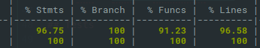

## Clone

`$~: git clone git@github.com:torto/CurrencyFair.git`

## Install and Execute

`~$ cd front-end`

`~/back-end$ npm install`

`~/back-end$ npm run start`

## URL

Main url: `http://localhost:3000`

## Tests

Normal test: `~/front-end$ npm run test`

Coverage: `~/front-end$ npm run coverage`

